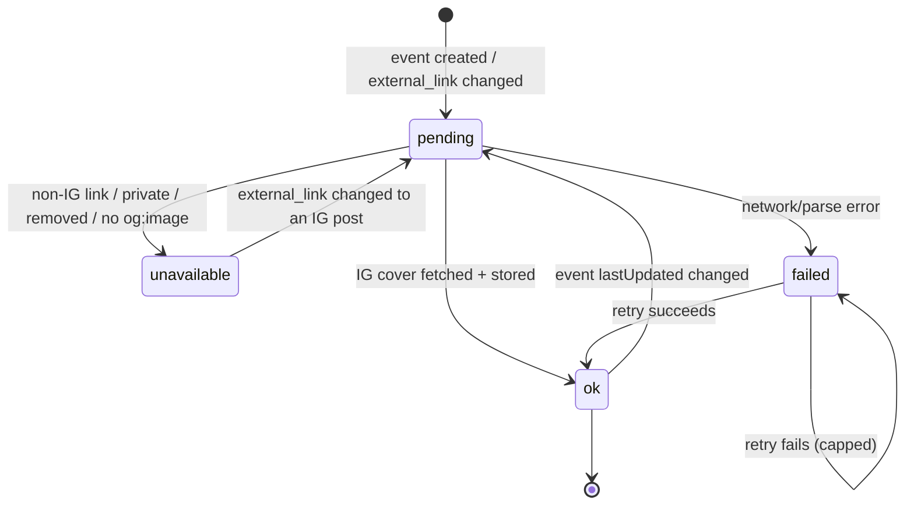
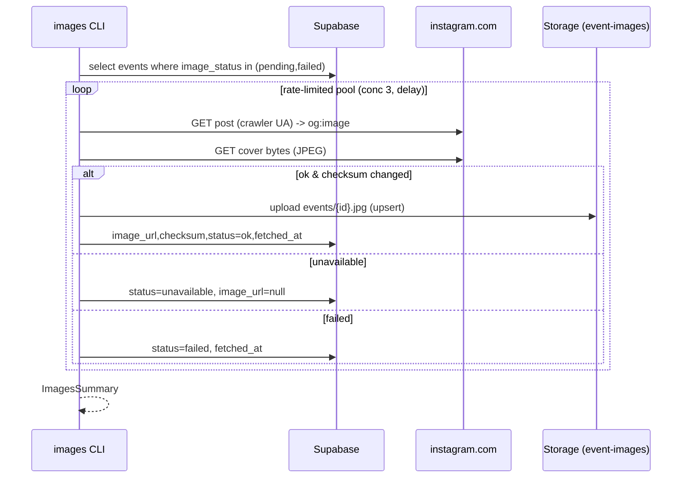

# Event Images — Design Specification

**Status:** Design (2026-06-30). Implements `./README.md`. Design artifacts only — build via `/sc:implement`.
**Grounding probes (2026-06-30):** crawler-UA `og:image` returns **JPEG already** (`image/jpeg`, FFD8, **640×640** progressive, ~80KB) — no HEIC/transcode needed. Larger variant requests 403 (signed URL) → **640×640 is the ceiling**. Source URLs are signed + expiring → must re-host bytes.

---

## 1. Design decisions

| # | Decision | Rationale |
|---|---|---|
| D1 | **No image-processing dependency** (no sharp/libheif) | IG already delivers JPEG via `dst-jpg`. Store bytes verbatim. Keeps it runnable in both Node and Deno, no native deps. |
| D2 | **Fixed 640×640 source** | Cannot fetch larger (signature breaks → 403). Acceptable for a phone hero (402pt). Note as v1 limitation; higher-res = future paid API. |
| D3 | **Status-queue model on `events`** (`pending→ok/failed/unavailable`) | Decouples fragile scraping from the fast paths; drives backfill + retries + placeholder. |
| D4 | **Pipeline (Node) OWNS image fetching** (backfill + reprocessing) | The 976-event backfill is a long, rate-limited batch — belongs in the CLI, not a webhook. Webhook/refresh just mark `pending`. |
| D5 | **Webhook/refresh never scrape synchronously** | Scraping is slow + fragile; keep webhook lean. They set `image_status='pending'`; the `images` command processes the queue. |
| D6 | **Re-host to a public Storage bucket, stable key** `events/{id}.jpg` | Own CDN, no expiry, deterministic URL; overwrite on update. |
| D7 | **Fail-soft to a bundled placeholder** | Scrape route breaks regularly + 52 non-IG events. App never shows a broken image. |
| D8 | **Idempotent via content checksum** | Skip re-upload when bytes unchanged; cache-bust URL with `?v=<checksum8>` when they change. |
| D9 | **`unavailable` ≠ `failed`** | Non-IG link / private / removed → `unavailable` (don't retry forever). Network/parse error → `failed` (retry next run). |

---

## 2. Image lifecycle (state machine)



---

## 3. Schema design (migration `0004_event_images.sql`)

```sql
-- events: image columns (additive, nullable, non-destructive)
alter table public.events
  add column image_url text,                       -- stable public URL of rehosted cover (null until ok)
  add column image_status text not null default 'pending'
    check (image_status in ('pending','ok','failed','unavailable')),
  add column image_checksum text,                  -- sha256 of stored bytes (idempotency)
  add column image_fetched_at timestamptz;

create index events_image_status_idx on public.events(image_status)
  where image_status in ('pending','failed');      -- the work queue

-- public storage bucket for rehosted covers
insert into storage.buckets (id, name, public)
values ('event-images','event-images', true)
on conflict (id) do nothing;

-- read is public (bucket.public = true). Writes are service-role only (bypasses RLS).
-- Explicit anon read policy for clarity:
create policy event_images_public_read on storage.objects for select
  to anon, authenticated using (bucket_id = 'event-images');
```

- **Key scheme:** `event-images/events/{webflow_item_id}.jpg`.
- **Public URL:** `{SUPABASE_URL}/storage/v1/object/public/event-images/events/{id}.jpg` — stored in `image_url` with `?v=<checksum8>` for cache-busting on change.
- `packages/db/src/types.ts`: extend events Row/Insert/Update with the 4 columns.

---

## 4. Module & interface design

### 4.1 Pure helpers — `packages/pipeline/src/instagram.ts`
```
isInstagramPostUrl(url: string | null): boolean
   // true for instagram.com/p|reel|tv/<shortcode>

extractOgImage(html: string): string | null
   // parse <meta property="og:image" content="...">, unescape &amp;, return URL or null

CRAWLER_UA = "facebookexternalhit/1.1 (+http://www.facebook.com/externalhit_uatext.php)"
```

### 4.2 Fetcher — `packages/pipeline/src/image-fetcher.ts`
```
type CoverResult =
  | { status: 'ok'; bytes: Uint8Array; contentType: string; checksum: string }
  | { status: 'unavailable' }     // not IG, or no og:image (private/removed)
  | { status: 'failed'; reason: string }   // network/non-200/parse

fetchInstagramCover(postUrl, deps:{ fetch, ua?=CRAWLER_UA }): Promise<CoverResult>
   1. if !isInstagramPostUrl -> 'unavailable'
   2. GET post with CRAWLER_UA -> if !200 -> 'failed'
   3. extractOgImage -> null -> 'unavailable'
   4. GET image URL -> verify content-type image/* and 200 -> bytes
      -> checksum = sha256(bytes); 'ok' | 'failed'
```
- Pure-ish, fully unit-testable with a stub `fetch` (no real network).
- Defensive: tolerate garbage HTML, non-image content-type, oversized responses (cap bytes).

### 4.3 Store — extend pipeline DB/storage client
```
uploadEventImage(client, eventId, bytes, contentType): Promise<publicUrl>
   // supabase storage .from('event-images').upload('events/{id}.jpg', bytes,
   //   { contentType, upsert:true }); return public URL
```

### 4.4 Orchestrator — `packages/pipeline/src/images.ts`
```
runImages({ db, fetcher, storage, logger, concurrency=3, minDelayMs=600 }):
  ImagesSummary { scanned, fetched, unavailable, failed, skipped }
  - select events where image_status in ('pending','failed')  (+ optional 'ok' if --refresh)
  - rate-limited pool (concurrency + delay; backoff on 429/5xx)
  - per event: fetchInstagramCover ->
      ok:          if checksum == events.image_checksum -> skip (idempotent)
                   else upload -> set image_url(+?v), image_checksum, image_status='ok', image_fetched_at
      unavailable: set image_status='unavailable', image_url=null
      failed:      set image_status='failed', image_fetched_at (retry next run)
```

### 4.5 CLI — `packages/pipeline/src/images-cli.ts` (script `images`)
`pnpm --filter @gulch/pipeline run images` — reads env (SUPABASE_URL, SERVICE_ROLE_KEY); backfill/idempotent reprocess. Mirrors `regeocode` CLI pattern.

---

## 5. Data flow

### 5.1 Backfill (Node pipeline)


### 5.2 Ongoing freshness
- **Webhook (event created):** event inserted with default `image_status='pending'` → no scraping in the webhook (D5).
- **refresh-tick (event changed):** when an event's `lastUpdated` changes, set `image_status='pending'` (cheap column update; mirror the managing-ref reconcile pattern). No scraping in the tick.
- **Processing:** re-run the `images` command (manual or scheduled, e.g. CI cron) to drain the `pending`/`failed` queue. *(Phase 2 option: let refresh-tick process a small capped batch of pending images per day, fail-soft — deferred to keep the daily edge function lean and non-fragile.)*

---

## 6. App rendering — `apps/mobile` Event Details (node 2056-10950)

```
hero = events.image_status === 'ok' && events.image_url
         ? <Image source={{uri: image_url}} resizeMode="cover" />   // our CDN
         : <PlaceholderHero />                                       // bundled branded asset
// gradient scrim overlay on top (per Figma); 640x640 source cover-cropped to hero box
// top-right external-link button -> opens events.external_link (attribution/link-back)
```
- No client scraping, no HEIC handling. Single network image from our CDN.
- Placeholder is a bundled asset (design-provided) — used for `unavailable`/`failed`/`pending`/null.

---

## 7. Edge cases

| Case | Handling |
|---|---|
| Non-IG `external_link` (52 events) | `isInstagramPostUrl` false → `unavailable` → placeholder |
| Private / removed post | crawler-UA still 200 but no og:image → `unavailable` |
| Meta breaks og:image route | `extractOgImage` null → `unavailable`/`failed`; failure-rate spike is the monitoring signal |
| 429 / rate limit | backoff + retry within run; remaining stay `pending`/`failed` for next run |
| Image bytes not image/* | reject → `failed` |
| Oversized response | cap download size → `failed` |
| Same image on re-fetch | checksum match → skip upload (idempotent) |
| Cover changed for same post | checksum differs → re-upload + bump `?v=` to bust CDN cache |
| null `external_link` (1) | `unavailable` |

---

## 8. Test plan (TDD ≥90%)

- **`instagram.ts`:** `isInstagramPostUrl` (p/reel/tv/non-IG/null); `extractOgImage` (present, absent, `&amp;` unescape, malformed HTML).
- **`image-fetcher.ts`** (stub fetch): ok path (post→og:image→jpeg bytes→checksum); unavailable (non-IG, no og:image); failed (non-200, non-image content-type, oversized); never throws.
- **`images.ts`** (stub db/fetcher/storage): pending+failed selected; idempotent skip on checksum match; status transitions ok/unavailable/failed; rate-limit/concurrency honored; summary counts; `--refresh` reprocesses ok.
- **schema (`packages/db`):** image columns + defaults; `image_status` check constraint; partial index; storage bucket public-read policy (if testable in ephemeral PG, else assert via migration apply).
- **edge:** webhook leaves new events `pending`; refresh-tick marks changed events `pending` (no scraping).

---

## 9. Rollout

1. Migration `0004_event_images.sql` (events columns + `event-images` bucket + read policy).
2. `packages/db/types.ts` extend events.
3. `packages/pipeline`: `instagram.ts`, `image-fetcher.ts`, storage upload, `images.ts`, `images-cli.ts` (+ tests).
4. Edge: webhook/refresh-tick mark `image_status='pending'` on create/change (+ tests).
5. Apply migration to cloud; run `pnpm --filter @gulch/pipeline run images` backfill (batched, ~8–16 min for 976) → verify `ok` counts + sample image_urls render.
6. `apps/mobile` Event Details: hero + placeholder fallback (part of the v1 UI build).

**Guard each commit:** stray `bun.lock` / dropped `turbo` (see memory `never-hand-merge-lockfile`).

---

## 10. First-principles takeaways

1. **The HEIC scare was a non-issue** — IG serves JPEG; the design drops all transcoding and native deps.
2. **640×640 is a hard ceiling** — signed URLs forbid upscaling at the source; fine for v1 phone hero.
3. **Decouple fragile scraping via a status queue** — fast paths only enqueue; one rate-limited batch command does the risky work and is safely re-runnable.
4. **Fallback is a first-class state**, not an afterthought — 5% of events + inevitable Meta breakage depend on it.
