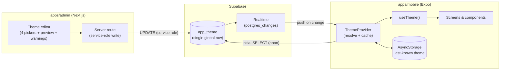
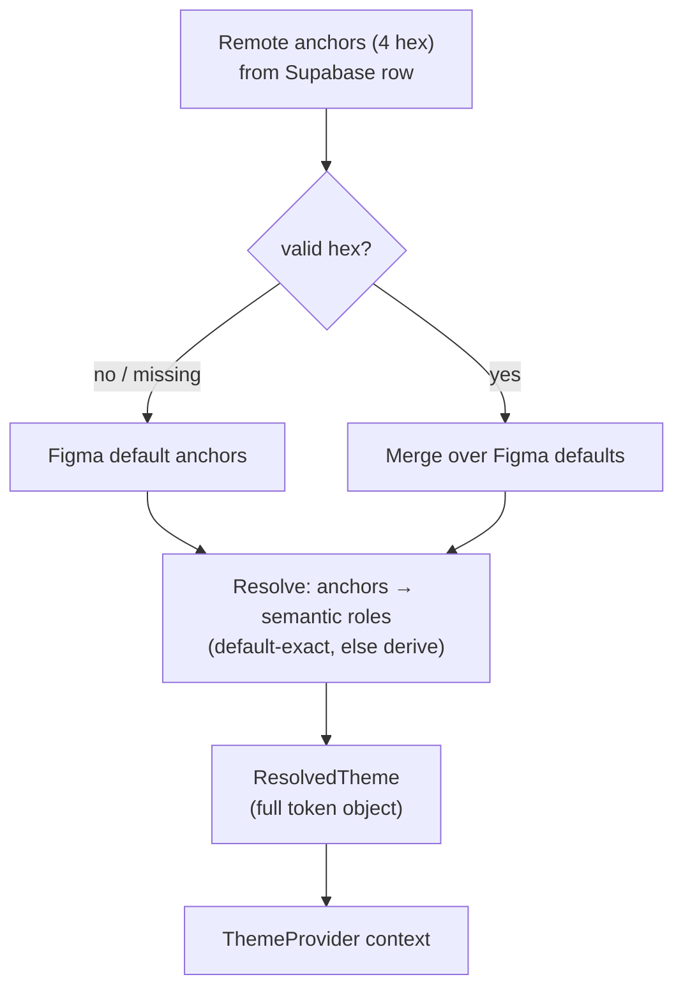
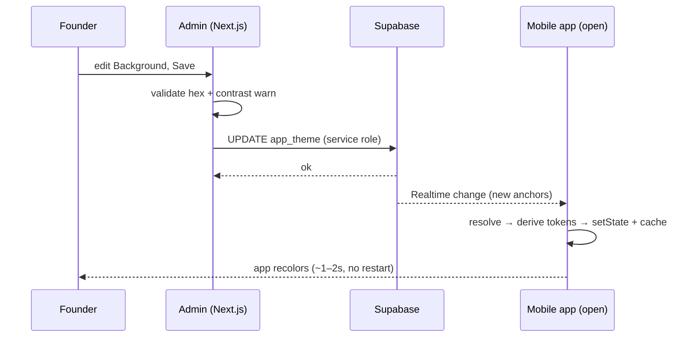

# Live Theme Control — Design

**Status:** Design (for sign-off). Requirements: see memory `live-theme-feature`. Next: `/sc:workflow` → `/sc:implement`.
**Scope (locked in brainstorm):** mobile only · one global theme · 4 semantic controls (Background, Surface, Accent, Text) · free-form hex · warn-only contrast · instant-live via Supabase Realtime · no auth this pass · Figma = default/fallback · ships **before** first TestFlight build.

---

## 1. Overview

The founder edits 4 colors in the admin console; every open mobile app recolors within ~1–2s. The theme is **data**, not code, so no App Store resubmit. The 4 controls are *anchors* that drive the app's full token set by a documented mapping; anything not driven stays at its Figma default.

Design pillars (first-principles):
- **One source of truth at runtime** — the app must read colors from a `ThemeProvider`, not the compile-time `color`/`semantic` constants it uses today (17 files).
- **Never brick the app** — invalid/missing/offline theme falls back to the exact Figma palette; cached last-known applied before first paint.
- **Figma fidelity at default** — when an anchor equals its Figma default, every token it drives uses the *exact* Figma value (no lossy color math). Derivation only runs for overridden anchors.

---

## 2. Architecture



- **Read path:** anon `SELECT` on the single row (RLS allows anon read).
- **Write path:** the admin **Next.js server** writes with the `SUPABASE_SERVICE_ROLE_KEY` (server-only). This satisfies "no auth this pass" (no login UI) **without** opening the table to public writes — strictly better than anon-write. RLS therefore: anon = read-only; no anon write policy.
- **Live path:** table added to the `supabase_realtime` publication; the app subscribes to row changes.

---

## 3. Token model — 4 anchors → semantic roles → raw tokens

The app today exposes a `semantic` layer in `apps/mobile/theme/index.ts` but components bypass it and use raw `color.*`. The design routes everything through resolved **semantic roles** driven by the 4 anchors.

### Mapping & derivation

| Semantic role (new runtime) | Figma default | Driven by | When the anchor is overridden |
|---|---|---|---|
| `screenBg` / `headerBg` / `navBg` | `darkChocolate` `#3F220F` | **Background** | = Background |
| `elevatedSurface` (card time-pill, heart button) | `darkChocolate` `#3F220F` | **Background** | = Background |
| `recessedBg` (Events list, Lineup, Event Detail screens) | `oreo` `#291407` | **Background** | = `darken(Background)` |
| `border` / `shadow` | `oreo` `#291407` | **Background** | = `darken(Background)` |
| `badgeSolidBg` | `oreo` `#291407` | **Background** | = `darken(Background)` |
| `surface` (compact banner card) | `brown300` `#93684B` | **Surface** | = Surface |
| `surfaceAlt` (full-width banner) | `brown400` `#543C2D` | **Surface** | = `darken(Surface)` |
| `accent` | `gulchGreen` `#D9FF71` | **Accent** | = Accent |
| `textOnDark` | `white` `#FFFFFF` | **Text** | = Text |
| `textMutedOnDark` | `khakis` `#DBD1C3` | **Text** | = `mix(Text → Background, ~0.2)` |
| `textOnLight` (dark text on light banners) | `darkChocolate` `#3F220F` | **Background** | = Background |

**Fixed (not themeable — always Figma default):** `brown100` (light banner surface), `white` (button surface), `beige300` (light button / "Sponsored"), `latte` (Editor's Pick badge — brand), `grey100`, `grey80` (placeholder), `black`.

**Why this mapping is coherent under free-form colors:**
- Today's two dark shades are preserved as a relationship: list/detail screens (`recessedBg`) are a *derived darker shade* of `Background`, and card pills (`elevatedSurface`) equal `Background`. So the PR #17 contrast (pill reads against the darker list bg) holds for **any** chosen Background.
- `darken`/`mix` are HSL-space transforms (lightness reduction / linear blend). **Default-exact rule:** if `Background == #3F220F`, `recessedBg` snaps to the exact Figma `#291407` (not the computed approximation); likewise `textMutedOnDark` snaps to `#DBD1C3`. Derivation only runs when the anchor differs from its Figma default.

### Contrast warnings (warn-only)
Admin computes WCAG contrast for the worst-case pairs and warns (never blocks):
- `Text` vs `Background` (covers cards/Home; also covers the darker `recessedBg` since darker bg = higher contrast for light text).
- `Text` vs `Surface` (banners).
Thresholds: < 4.5:1 → "may be hard to read"; < 3:1 → "very low contrast".

---

## 4. Data model (Supabase)

Single enforced global row.

```sql
-- migration 0006_app_theme.sql (additive)
create table public.app_theme (
  id          text primary key default 'global' check (id = 'global'),
  background  text not null,
  surface     text not null,
  accent      text not null,
  text        text not null,
  updated_at  timestamptz not null default now(),
  constraint app_theme_hex check (
    background ~* '^#[0-9a-f]{6}$' and surface ~* '^#[0-9a-f]{6}$'
    and accent ~* '^#[0-9a-f]{6}$' and text ~* '^#[0-9a-f]{6}$'
  )
);

-- RLS: public read, no public write (writes via service role only)
alter table public.app_theme enable row level security;
create policy app_theme_anon_read on public.app_theme for select to anon, authenticated using (true);

-- Seed the global row with the Figma defaults
insert into public.app_theme (id, background, surface, accent, text)
values ('global', '#3F220F', '#93684B', '#D9FF71', '#FFFFFF')
on conflict (id) do nothing;

-- Realtime
alter publication supabase_realtime add table public.app_theme;
```

- **Single row** (`id='global'`) → last-write-wins, no concurrency model needed for one editor.
- Hex `CHECK` is defense-in-depth; the app **also** validates and falls back per-field.
- No `Insert`/`Update` policy for anon → table is read-only to the public; the admin server uses the service role.

---

## 5. App runtime design

### Resolution pipeline


### ThemeProvider lifecycle (root `app/_layout.tsx`)
1. **First paint:** synchronously apply the **cached** theme from AsyncStorage, or Figma default if none → no flash of wrong colors.
2. **Hydrate:** `SELECT` the global row; resolve; update context; write-through to AsyncStorage.
3. **Subscribe:** Realtime channel on `app_theme`; on change → resolve → update context + cache.
4. **Resilience:** fetch/subscribe failure → keep cached/default; retry/reconnect re-hydrates. App is always renderable.

### Consumption (`useTheme()`)
- New hook returns the resolved `{ color, semantic }` shape (same names as today) so component edits are minimal: `import { color } from "../theme"` → `const { color } = useTheme()`.
- **StyleSheet caveat:** module-scope `StyleSheet.create({...color.X...})` is static and can't see context. Strategy: a `useThemedStyles(factory)` hook that memoizes a stylesheet **per resolved theme** (recompute only when the theme object identity changes). Layout-only styles can stay static; only color-bearing styles move into the factory.

---

## 6. Refactor plan (NFR3)

17 files import raw `color.*`. Scope is bounded — only **themeable** tokens need to become dynamic:
- **Dynamic (route through `useTheme`/`useThemedStyles`):** the 14 background sites found (screens, `Header`, `TabBar`, `EventCard` pill/heart, `Badge`) + text colors (`white`/`khakis`) + `accent` (`gulchGreen`) + `border`/`shadow` (`oreo`).
- **Leave static:** the fixed tokens (greys, beige300, latte, brown100, white-as-button-surface) — they never change, so importing them as constants is fine.

Phasing: introduce `ThemeProvider` + `useTheme` returning Figma defaults first (no visual change, fully testable), then migrate files screen-by-screen, then wire Supabase + Realtime, then the admin editor. Each step is independently shippable and visually a no-op until the founder changes a color.

---

## 7. Admin editor design (`apps/admin`)

- **UI:** 4 labeled color fields — Background, Surface, Accent, Text — each a hex input + native color picker, seeded from the current row.
- **Live preview:** a mini mock of an event card + list screen rendered with the in-progress anchors (uses the same resolution/derivation logic, shared as a small pure module so admin and app agree).
- **Warnings:** inline WCAG contrast notices (§3), non-blocking.
- **Actions:** **Save** (POST → server route → service-role `UPDATE`), **Reset to default** (writes the Figma defaults).
- **Write path:** Next.js route handler / server action holding `SUPABASE_SERVICE_ROLE_KEY` (server-only env). The browser never holds the service key.

---

## 8. Sequence — live edit



---

## 9. Interfaces (design-level types)

```ts
type Hex = `#${string}`;
interface ThemeAnchors { background: Hex; surface: Hex; accent: Hex; text: Hex }
interface ResolvedTheme { color: ColorTokens; semantic: SemanticRoles } // same shape as today's theme
function resolveTheme(anchors: Partial<ThemeAnchors>): ResolvedTheme;     // pure; shared by app + admin preview
function useTheme(): ResolvedTheme;
function useThemedStyles<T>(factory: (t: ResolvedTheme) => T): T;
// Supabase row
interface AppThemeRow extends ThemeAnchors { id: "global"; updated_at: string }
```

---

## 10. Edge cases, risks, security

- **Invalid/partial remote values** → per-field fallback to Figma default; never throws.
- **Offline / Realtime drop** → cached theme persists; reconnect re-hydrates.
- **Bad contrast shipped** (warn-only) → allowed by design; mitigated by one-click Reset.
- **"Figma wins"** → defaults in code track Figma; a live override *masks* later Figma changes until **Reset**. Surface a small "using custom override" indicator in admin so designers aren't surprised.
- **Security (deferred-auth, tracked):** no end-user auth, but the table is **not** publicly writable — only the admin server (service role) writes. Add real admin auth before any external exposure. Service-role key stays server-only; never shipped to the app or browser.
- **Performance:** one Realtime channel, single tiny row; negligible. First paint never blocked on network.

---

## 11. Migration & sequencing

- **DB:** migration `0006_app_theme` (table + RLS read policy + seed + realtime publication). Additive; auto-applies via the Supabase GitHub integration on merge (as `0005` did).
- **Order (ships before TestFlight):** (1) ThemeProvider + `useTheme` returning Figma defaults, (2) migrate the ~14 dynamic sites, (3) Supabase row + Realtime subscription + caching, (4) admin 4-color editor (preview, warnings, reset, service-role write). Steps 1–2 are visual no-ops and independently mergeable.
- **Verification gates (unchanged):** typecheck + lint + vitest (provider/resolve unit tests, ≥90% on the pure resolver) + expo export; admin build.

---

## 12. Open design decisions (need sign-off)

1. **Derivation vs. flat:** approve the **anchor + derivation** model (recommended — keeps the dual-shade UI coherent under any color), or prefer a flat 1:1 mapping (Background→one bg only) where the second shade stays fixed (simpler, but list screens/pills can clash with a custom Background)?
2. **`darken`/`mix` deltas:** sign off on the exact transform amounts (proposed: `recessedBg` = Background lightness −35%; `surfaceAlt` = Surface lightness −18%; `textMuted` = Text mixed 20% toward Background). Default-exact rule means these only matter for overrides.
3. **Admin write path:** confirm **service-role server write** (recommended) vs. a temporary anon-write policy (simpler infra, but publicly writable — not recommended even for a demo).
4. **Preview fidelity:** mini mock components in admin (proposed) vs. an embedded Expo web preview (heavier).
