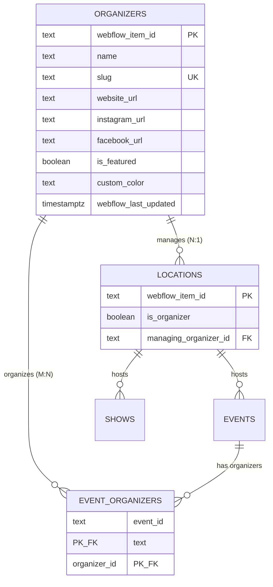
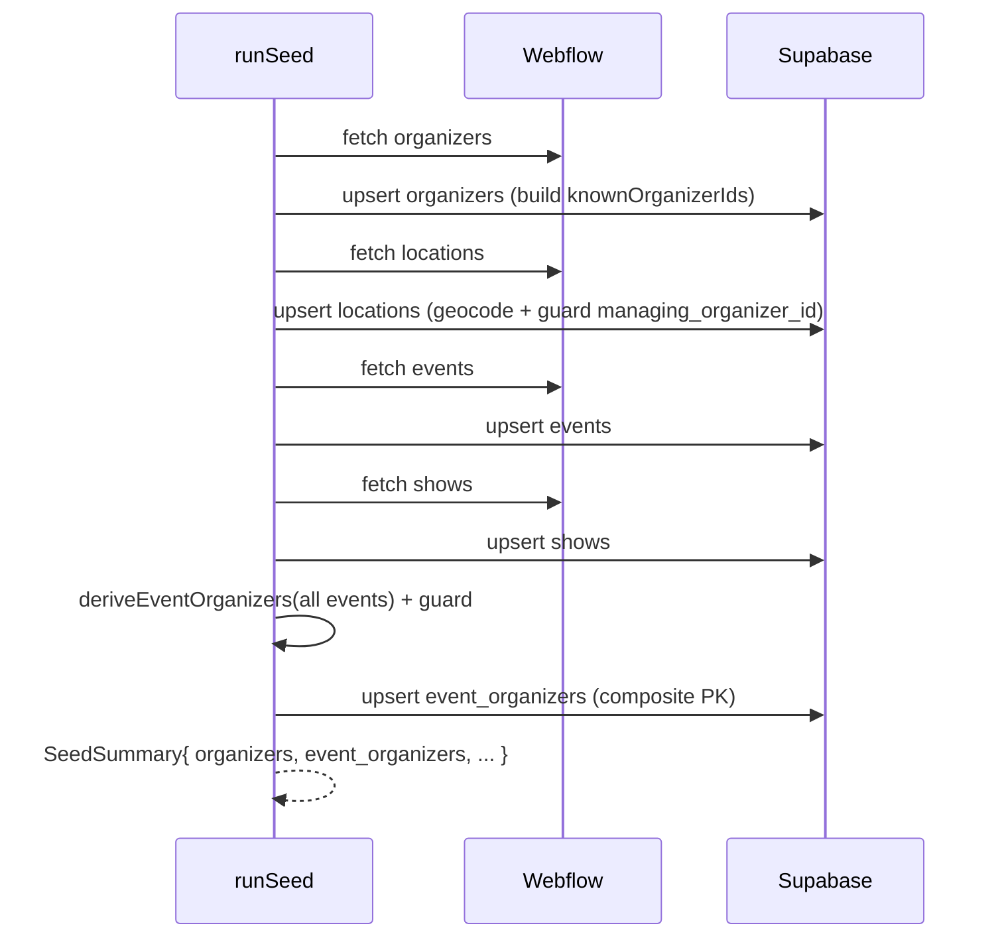

# Organizers — Design Specification

**Status:** Design (2026-06-29). Implements requirements in [`./README.md`](./README.md). Design artifacts only — build via `/sc:implement`.
**Constraints:** additive & non-destructive; mirrors existing v1 architecture (text PKs = Webflow item id, service-role writes, anon/auth read, idempotent upserts, dual TS/Deno mirror). All data Webflow-derived; **0% populated today** → must be correct against empty + populated.

---

## 1. Design decisions (first-principles)

| # | Decision | Rationale |
|---|---|---|
| D1 | **Managing organizer = nullable FK column `locations.managing_organizer_id`**, not a junction | Webflow `locations.managing-organizer` is a *single* Reference → N:1 (one location ≤1 managing org). A junction would model a non-existent M:N. KISS/YAGNI. |
| D2 | **Event organizers = junction `event_organizers`** (composite PK) | `events.additional-organizers` is a MultiReference → true M:N. Explode array into rows. |
| D3 | **`is_organizer` = plain boolean column on locations** | It's a self-flag ("this venue is also an org entity"), not a link. Distinct from D1. |
| D4 | **Organizers seeded FIRST** (new order: organizers → locations → events → shows → event_organizers) | `locations.managing_organizer_id` and `event_organizers.organizer_id` FK → organizers; referenced rows must pre-exist. |
| D5 | **Referential-integrity guard: drop/null dangling refs** against the seeded organizer-id set | Webflow filters draft/archived items; a location/event may reference an organizer we excluded → would FK-violate. Transform nulls (managing) or skips (junction) unknown organizer ids. |
| D6 | **No geocoding for organizers** | No address field. |
| D7 | **`event_organizers` is fully derived → per-event replace on update** | A junction from an array needs delete-stale-on-change; upsert-only (current pattern) can't remove links. New reconcile op; seed can upsert (composite PK). |
| D8 | **Webhook = create-only (unchanged pattern); refresh-tick = diff reconcile incl. relationships** | Matches existing arch (webhook handles `collection_item_created`; updates propagate via daily refresh). Deletes remain out-of-scope as today. |
| D9 | **`custom_color` stored as `text`** (hex `#rrggbb`) | Webflow Color field returns a hex string; no native PG type needed. |

---

## 2. Entity-relationship model



---

## 3. Database schema (migration design — `0003_organizers.sql`)

```sql
-- 1. organizers (mirrors locations table conventions)
create table public.organizers (
  webflow_item_id text primary key,
  name text not null,
  slug text not null unique,
  website_url text,
  instagram_url text,
  facebook_url text,
  is_featured boolean not null default false,
  custom_color text,                         -- hex "#rrggbb" from Webflow Color
  webflow_last_updated timestamptz,
  created_at timestamptz not null default now(),
  updated_at timestamptz not null default now()
);

-- 2. locations additive columns (non-destructive)
alter table public.locations
  add column is_organizer boolean not null default false,
  add column managing_organizer_id text
    references public.organizers(webflow_item_id) on delete set null;

-- 3. event_organizers junction (M:N, derived from events.additional-organizers)
create table public.event_organizers (
  event_id text not null references public.events(webflow_item_id) on delete cascade,
  organizer_id text not null references public.organizers(webflow_item_id) on delete cascade,
  created_at timestamptz not null default now(),
  primary key (event_id, organizer_id)
);

-- 4. indexes
create index organizers_is_featured_idx on public.organizers(is_featured) where is_featured = true;
create index locations_managing_organizer_idx on public.locations(managing_organizer_id);
create index event_organizers_organizer_idx on public.event_organizers(organizer_id);

-- 5. updated_at trigger (reuse public.set_updated_at)
create trigger organizers_set_updated_at
  before update on public.organizers
  for each row execute function public.set_updated_at();

-- 6. RLS + grants (mirror existing pattern)
alter table public.organizers enable row level security;
alter table public.event_organizers enable row level security;

create policy organizers_select_anon on public.organizers for select to anon using (true);
create policy organizers_select_authenticated on public.organizers for select to authenticated using (true);
create policy organizers_all_service_role on public.organizers for all to service_role using (true) with check (true);

create policy event_organizers_select_anon on public.event_organizers for select to anon using (true);
create policy event_organizers_select_authenticated on public.event_organizers for select to authenticated using (true);
create policy event_organizers_all_service_role on public.event_organizers for all to service_role using (true) with check (true);

grant select on public.organizers, public.event_organizers to anon, authenticated;
grant all on public.organizers, public.event_organizers to service_role;
```

**Cascade rationale:** `event_organizers` rows have no independent meaning → `on delete cascade` from both parents. `locations.managing_organizer_id` → `on delete set null` (the location survives its org's deletion). Note: the current pipeline never *deletes* parent rows, so cascade is a correctness safety-net, not the live mechanism (delete-handling stays out of scope, consistent with v1).

---

## 4. Type & schema interfaces

### 4.1 `packages/db/src/types.ts` (hand-authored mirror — additions)
- New `organizers` table: `Row`/`Insert`/`Update` (Insert: optional everything except `webflow_item_id`, `name`, `slug`).
- New `event_organizers` table: Row `{ event_id, organizer_id, created_at }`; Insert `{ event_id, organizer_id, created_at? }`; Relationships → events + organizers.
- `locations` Row/Insert/Update gain `is_organizer: boolean` + `managing_organizer_id: string | null`; add Relationship `locations_managing_organizer_id_fkey → organizers`.

### 4.2 Zod schemas — `packages/shared/src/webflow-schemas.ts` + Deno mirror `_shared/schemas.ts`
```ts
// NEW
export const organizerFieldDataSchema = z.object({
  name: requiredString,
  slug: requiredString,
  "website-url": optionalString,
  "instagram-url": optionalString,
  "facebook-url": optionalString,
  "is-featured": z.boolean().nullable().optional(),
  "custom-color": optionalString,            // hex or null
});

// EXTEND locationFieldDataSchema (stop stripping new fields)
  "is-organizer": z.boolean().nullable().optional(),
  "managing-organizer": optionalString,      // single organizer item id

// EXTEND eventFieldDataSchema — MultiReference → array of organizer item ids.
// Defensive: accept string[] (documented v2 shape); tolerate {id}[] just in case.
  "additional-organizers": z.array(z.union([z.string(), z.object({ id: z.string() }).passthrough()]))
    .nullish().transform(a => (a ?? []).map(x => typeof x === "string" ? x : x.id)),
```
> ⚠️ **Verify on first populated data** (0/1029 today): confirm v2 returns `string[]`. The union+transform makes the mapper resilient either way.

---

## 5. Transformation / mapper design

### 5.1 New & changed mappers (`packages/shared/src/mappers.ts` + Deno mirror)
```
mapOrganizer(raw) -> OrganizerInsert
  { webflow_item_id, name, slug, website_url, instagram_url, facebook_url,
    is_featured ?? false, custom_color, webflow_last_updated }

mapLocation(raw) -> LocationInsert            // EXTENDED
  ...existing... + is_organizer ?? false + managing_organizer_id (raw ref or null)

deriveEventOrganizers(eventItem) -> { event_id, organizer_id }[]   // NEW (pure)
  additional-organizers array -> one row per organizer id, de-duplicated
```

### 5.2 Referential-integrity guard (D5) — applied in pipeline, not mapper
```
knownOrganizerIds: Set<string>           // built from seeded/loaded organizers
locations:   managing_organizer_id ∉ known  -> set null (+log)
event_orgs:  organizer_id ∉ known           -> skip row (+log)
event_orgs:  event_id ∉ known events        -> skip row (+log)
```

---

## 6. Pipeline data flow

### 6.1 Seed (`packages/pipeline/src/seed.ts`) — new order + relationship stage

- `WEBFLOW_COLLECTION_IDS.organizers = "6a430e64b51f80db57a22b3c"`.
- `SeedSummary` extended: `organizers{fetched,upserted}`, `eventOrganizers{derived,upserted,skipped}`.

### 6.2 Webhook (`webflow-webhook` — create-only, additive)
- Register `organizers` in `COLLECTIONS` + `TABLE_BY_COLLECTION_ID`.
- `collection_item_created`:
  - organizer → `mapOrganizer` → upsert.
  - location → existing flow + new columns (guard managing ref).
  - event → existing flow **+ replace event_organizers for that event_id** (delete-then-insert, guarded).

### 6.3 Refresh-tick (`refresh-tick` — diff reconcile)
- `ORDER = ["organizers","locations","events","shows"]` (organizers first).
- For changed events (by `lastUpdated`): re-derive + **replace** their `event_organizers` rows (D7).
- For changed locations: reconcile `managing_organizer_id` (guarded) alongside geocode logic.
- `reconcile.ts` gains: organizer branch (plain map) + an event-organizers replace step returning `{ upserts, deletes }` per changed event.

---

## 7. Edge cases & handling

| Case | Handling |
|---|---|
| `additional-organizers` empty/null | `deriveEventOrganizers` → `[]`; no rows. (Today: all events.) |
| Duplicate organizer id in array | De-dup before insert (composite PK also protects). |
| Location references draft/archived organizer | D5 guard → `managing_organizer_id = null`. |
| Event references draft/archived organizer | D5 guard → skip that junction row. |
| Organizer removed from an event on update | Per-event **replace** in refresh-tick deletes the stale row (D7). |
| MultiReference returns objects not strings | Schema union+transform normalizes to id strings (§4.2). |
| `custom_color` malformed | Stored as-is (text); UI validates. No pipeline failure. |
| Organizer slug collision | `slug` UNIQUE — Webflow guarantees unique slugs; violation surfaces as upsert error (fail-loud). |

---

## 8. Test plan (requirement → tests, TDD ≥90%)

- **Schema (`packages/db`):** organizers RLS (anon read 200, anon write 42501, service write ok); `event_organizers` RLS; `managing_organizer_id` FK set-null on organizer delete; cascade on event/organizer delete. *(ephemeral PG)*
- **Schemas/mappers (`packages/shared`):** `mapOrganizer` happy/optional-null; `mapLocation` new fields; `deriveEventOrganizers` empty / single / multi / duplicate / object-shaped array; parse rejects missing name/slug.
- **Pipeline (`packages/pipeline`):** seed order (organizers before dependents); D5 guard (dangling managing → null, dangling junction → skipped); `event_organizers` derived counts; idempotent re-seed.
- **Edge (`supabase/functions/tests`):** webhook organizer create; event create replaces junction; refresh-tick re-derives changed events + reconciles managing ref; Deno↔node mapper parity.

---

## 9. Rollout ordering

1. Migration `0003_organizers.sql` (organizers table → locations alter → junction).
2. `packages/db/types.ts` extend (typecheck gate).
3. `packages/shared` schemas+mappers (+ Deno mirror parity).
4. `packages/pipeline` seed + collection id + guard.
5. Edge `_shared` + webhook + refresh-tick.
6. Apply migration to cloud (`SUPABASE_DB_PASSWORD` + `--linked`); re-run seed (idempotent); verify anon read + RLS.
7. Register organizers webhook in Webflow (additive).

**Guard each commit:** grep for stray `bun.lock` / dropped `turbo` (see memory `never-hand-merge-lockfile`).
